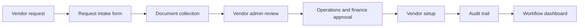

# Vendor Onboarding Workflow Automation System

## Project Overview

This repository documents the analysis and proposed design for a vendor onboarding workflow automation system. It focuses on moving vendor setup away from email chains, attachments, and spreadsheets into a controlled workflow with request intake, document checks, approval stages, status visibility, and reporting.

Key capabilities:

- Current-state and future-state workflow analysis.
- Functional and non-functional requirements.
- Vendor onboarding tracker template.
- Screen mockups and KPI dashboard concept.
- Sample vendor onboarding dataset.
- Business rules for approvals, document completeness, and status tracking.

## Architecture

The repository defines a proposed workflow architecture rather than a deployed application.



End-to-end pipeline:

1. A vendor onboarding request is submitted.
2. Required vendor details and documents are captured.
3. Vendor admin checks completeness and flags missing information.
4. Operations and finance approvals are recorded.
5. Approved vendors move to setup.
6. Status, timestamps, blockers, and completion metrics feed dashboard reporting.

## Tech Stack

| Layer | Tooling | Purpose |
|---|---|---|
| Documentation | Markdown | Analysis, requirements, workflows, business rules |
| Diagrams | Mermaid-compatible Markdown | Current and future process communication |
| Data artifact | CSV | Sample vendor onboarding records |
| Mockups | Markdown | Low-fidelity screens and dashboard concept |
| Runtime | Not applicable | No executable application is included |

## Data Flow

1. Ingestion: vendor requests enter through a proposed request form or controlled intake process.
2. Processing: vendor details, documents, approvals, and blockers are checked against workflow rules.
3. Storage: the proposed tracker stores vendor status, owners, required documents, approval outcomes, and dates.
4. Transformation: tracker fields are summarized into onboarding cycle time, backlog, blocked requests, and document completeness metrics.
5. Serving: workflow screens, tracker views, and dashboards support operations, finance, vendor admin, and managers.

## Setup Instructions

### Prerequisites

- Markdown viewer or editor
- Mermaid-compatible viewer for process diagrams
- Spreadsheet tool for sample CSV data

### Environment Variables

No environment variables are required. The repository has no runtime service.

### Docker Setup

Docker is not required for this documentation repository.

### Local Run Steps

Open `Workflow_Automation_System_Analysis.md` first, then review the artifacts under `artifacts/`.

## Project Structure

```text
.
|-- Workflow_Automation_System_Analysis.md # Main analysis and requirements document
|-- artifacts/
|   |-- as_is_process.md                   # Current manual onboarding process
|   |-- to_be_process.md                   # Future automated workflow
|   |-- vendor_onboarding_tracker.md       # Tracker template
|   |-- screen_mockups.md                  # Low-fidelity workflow screens
|   |-- sample_dataset.csv                 # Sample onboarding data
|   |-- kpi_dashboard_mockup.md            # KPI dashboard concept
```

## Key Components

### ETL Pipeline

No ETL pipeline is implemented. A future system could ingest vendor requests from forms or spreadsheets, validate required fields, and transform them into workflow records.

### Streaming Pipeline

No streaming pipeline is included. A future implementation could emit events for missing documents, approval requests, blocked onboarding, and completed setup.

### dbt Models

No dbt models are included. Future analytics models could calculate average onboarding time, blocked-request aging, document completeness, approval bottlenecks, and vendor category trends.

### API Layer

No API is implemented. Future endpoints would likely cover vendor requests, document status, approval actions, workflow status, comments, and dashboard metrics.

### Data Quality Checks

Recommended checks include required vendor name, category, owner, required documents, approval status, finance setup status, blocker reason, completion date, and audit notes.

## Testing

There are no automated tests. Review the repository by checking traceability between process gaps, requirements, business rules, mockups, tracker fields, and dashboard metrics.

## Troubleshooting

| Issue | Fix |
|---|---|
| Workflow has unclear ownership | Check that each status has an accountable team or role |
| Dashboard metrics are hard to calculate | Confirm the tracker captures dates, status, owner, blockers, and completion fields |
| Process feels overbuilt | Re-focus on request intake, document completeness, approvals, and setup visibility |
| Diagram rendering fails | Use a Mermaid-compatible Markdown viewer |

## Future Improvements

- Add OpenAPI-style requirements for workflow endpoints.
- Add a status transition matrix.
- Convert sample data into a normalized schema.
- Add notification rules for approval reminders and blocked requests.
- Add role-based access requirements for operations, finance, vendor admin, and managers.
- Add a future integration view for finance or supplier master-data systems.
