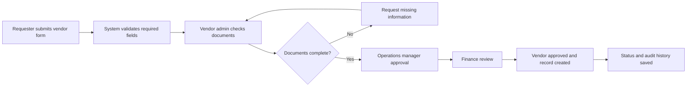

# Vendor Onboarding Workflow Automation System

## 1. Project Overview

This project looks at the vendor onboarding approval process for a growing facilities and maintenance services company in Dublin.

The business needs to bring on vendors quickly for cleaning supplies, electrical work, emergency repairs, uniforms, and equipment servicing. At the moment, new vendors are approved through email chains, attachments, shared folders, and Excel trackers.

Vendor onboarding was chosen because it is a small process that creates a lot of friction when it is not controlled properly. For a growing SME, slow vendor setup can delay site work, create finance issues, and leave managers unsure about what has actually been approved.

The aim is to show how a simple workflow automation system could improve visibility, ownership, document checks, and approval tracking.

## 2. Business Context

The company is a Dublin-based facilities and maintenance services business with around 55 employees.

It manages cleaning, maintenance, and emergency support across multiple client sites. As the business grows, it needs to onboard more vendors without slowing down operations.

The main users of the current process are:

- operations coordinators raising vendor requests
- operations managers approving business need
- finance checking supplier/payment details
- vendor admin collecting documents
- external vendors sending forms and certificates

Current tools are basic: Outlook, Excel trackers, shared folders, and the occasional Teams message when something is urgent.

This causes delays because information is split across different places. One person may have the insurance certificate in an email, another person may update the Excel tracker, and finance may be waiting on bank details without knowing operations has already chased the vendor.

## 3. Data & Approach

This is a case-study style analysis, not a review of a real company.

No real company data was used. The scenario is based on realistic SME operational workflows where teams often rely on email, spreadsheets, and shared folders.

The goal was to model a believable Business Systems Analyst problem and show how process analysis can lead to practical system requirements.

## 4. Problem Summary

The current vendor onboarding process is taking longer than it should.

A requester usually emails vendor details to an operations manager or vendor admin. Documents arrive separately, sometimes from the vendor and sometimes forwarded by operations. Finance checks supplier details later, but they may not be working from the same version of the information.

Nobody has one clear view of the request. It is hard to tell whether the delay is with the vendor, finance, operations approval, or missing documents.

The same vendor details are sometimes requested twice because different teams are keeping their own notes. There are also duplicate vendor records where names are entered slightly differently.

Approvals are inconsistent too. Some approvals are clear email replies. Others are buried inside long chains. If someone asks who approved a vendor and when, the answer takes too much digging.

## 5. Stakeholders

| Stakeholder | Role in the Process | Main Need |
|---|---|---|
| Operations Coordinator | Submits new vendor onboarding requests | Quick request submission and clear status updates |
| Operations Manager | Reviews business need and approves use of vendor | Confidence that the vendor is needed and suitable |
| Finance Reviewer | Checks payment, tax, and supplier setup details | Complete and accurate supplier information |
| Procurement / Vendor Admin | Collects documents and manages onboarding progress | One place to track documents, comments, and approvals |
| IT / System Owner | Maintains workflow system access and configuration | Simple, secure setup with manageable permissions |
| External Vendor | Provides company details and required documents | Clear instructions and fewer repeated requests |

## 6. Current State vs Future State

| Area | Current State | Future State |
|---|---|---|
| Request intake | Vendor requests arrive by email | Requester submits a structured onboarding form |
| Documents | Attachments are spread across email threads | Required documents are uploaded against the request |
| Approval | Approvals are mixed into email chains | Approval stages are routed and logged in the system |
| Status visibility | Teams check Excel or ask around | Everyone sees the current stage and owner |
| Finance handoff | Finance may receive incomplete details | Finance reviews only when required fields are complete |
| Reporting | No easy view of bottlenecks | Basic dashboard shows overdue and blocked requests |

## 7. Key Gaps Identified

1. Vendor documents are arriving through separate email threads, which makes it hard to see whether onboarding is actually complete.

2. The same supplier information is sometimes requested more than once because operations, finance, and admin are working from different trackers.

3. There is no single owner visible at each stage, so requests can sit with nobody clearly responsible.

4. Approvals are not always easy to prove because some decisions are buried in email chains.

5. Finance and operations do not always have the same vendor details, which increases the chance of duplicate or incorrect supplier records.

6. Managers cannot quickly see how many vendor requests are pending, overdue, blocked, or waiting on documents.

## 8. Business and System Requirements

### Functional Requirements

| ID | Requirement |
|---|---|
| FR-01 | The system should allow a requester to submit a new vendor onboarding request. |
| FR-02 | The system should capture required vendor details, category, site need, and contact information. |
| FR-03 | The system should allow required documents to be uploaded against the request. |
| FR-04 | The system should route the request to operations, vendor admin, and finance reviewers. |
| FR-05 | The system should show the current status, current owner, and due date for each request. |
| FR-06 | The system should allow reviewers to approve, reject, comment, or request missing information. |
| FR-07 | The system should store approval history, status changes, and rejection reasons. |
| FR-08 | The system should support basic search, filters, and reporting by status, owner, category, and due date. |

### Non-Functional Requirements

| ID | Requirement |
|---|---|
| NFR-01 | Access should be secure and based on user roles. |
| NFR-02 | Requesters should only see requests they submitted unless they have manager/admin access. |
| NFR-03 | The interface should be simple enough for operations staff to use without training sessions. |
| NFR-04 | Status changes and approvals should be auditable. |
| NFR-05 | Required fields should use validation to reduce incomplete or duplicate vendor records. |

## 9. Use Cases

| Use Case | Actor | Short Description |
|---|---|---|
| Submit onboarding request | Operations Coordinator | Creates a new vendor request with company details and reason for onboarding |
| Review vendor details | Vendor Admin | Checks whether the request is complete and documents are attached |
| Approve or reject vendor | Operations Manager / Finance Reviewer | Approves the request or rejects it with a reason |
| Request missing information | Vendor Admin / Finance Reviewer | Sends the request back for missing documents or unclear details |
| View onboarding history/status | Operations / Finance / Admin | Checks current stage, owner, comments, and approval history |

## 10. Process Flow

### As-Is Process

### To-Be Process

## 11. Data / System View

This is a simple logical view of the main records the system would need.

| Entity | Purpose |
|---|---|
| User | Stores internal users such as requesters, approvers, finance reviewers, and admins |
| Vendor | Stores vendor name, category, contact details, and supplier reference |
| Onboarding Request | Tracks the request, current status, owner, submitted date, due date, and category |
| Approval Step | Stores each approval stage, reviewer, decision, decision date, and comments |
| Document | Stores document type, upload status, expiry date, and file location |
| Status History | Logs status changes so the team can see what happened and when |
| Comment | Stores questions, notes, rejection reasons, and follow-up messages |

## 12. Sample API / System Interaction View

This is not meant to be a full technical specification. It shows the kind of actions a lightweight workflow system would need to support.

| Action | Example Endpoint | Purpose |
|---|---|---|
| Create vendor request | `POST /vendor-requests` | Submit a new onboarding request |
| View request list | `GET /vendor-requests` | Search or filter requests by status, owner, or category |
| Approve request | `PUT /vendor-requests/{id}/approve` | Record approval at the assigned stage |
| Request missing information | `PUT /vendor-requests/{id}/request-info` | Send the request back with comments |
| View vendor documents | `GET /vendors/{id}/documents` | Check uploaded documents and missing items |

## 13. Business Rules

1. A request cannot move to final approval if mandatory documents are missing.

2. The requester cannot approve their own vendor request.

3. Rejected requests must include a rejection reason.

4. Every status change must be logged with user, date, and action.

5. Overdue requests should be flagged once the SLA due date has passed.

6. Only assigned reviewers can approve, reject, or request information at their stage.

## 14. KPI / Success Metrics

- Average vendor onboarding turnaround time
- Number of overdue onboarding requests
- Percentage of requests completed without rework
- Number of requests blocked by missing documents
- Backlog by approver or current owner
- First-time completion rate

## 15. Recommended Solution

The recommended solution is a lightweight vendor onboarding workflow system, not a large enterprise procurement platform.

The system should start with a simple request form that captures vendor details, category, reason for onboarding, site need, and required documents. From there, the request should move through clear approval stages: vendor admin check, operations approval, and finance review.

Each request should show its current status, owner, due date, missing documents, comments, and approval history. This gives operations and finance one shared view instead of separate emails and trackers.

A basic dashboard would be enough at first. The business needs to see what is overdue, what is blocked, who owns each request, and where the main delays are happening.

## 16. Assumptions

| Assumption | Reason |
|---|---|
| Vendor onboarding volume is increasing as the company adds more client sites | This is the main reason the manual process is starting to fail |
| The company already uses Microsoft 365 or similar tools | SharePoint/Lists/Power Automate would be a realistic low-cost starting point |
| Finance approval is required before a vendor can be fully set up | Supplier payment details need basic review and control |
| The business wants visibility more than advanced automation | A simple workflow would solve most of the current pain |

## 17. Scope and Limitations

Included in scope:

- vendor request intake
- document checklist
- approval routing
- status tracking
- comments and rejection reasons
- audit history
- basic reporting

Out of scope:

- full procurement system replacement
- contract negotiation
- vendor performance scoring
- purchase order processing
- integration with accounting software
- legal review of supplier contracts

## 18. Key Insight

The issue is not that vendor onboarding is especially complex.

The issue is that the process has no shared control point. Delays happen because information is fragmented, not because staff are unwilling to follow up.

Once the request, documents, owner, approval stage, and history sit in one place, most of the confusion becomes easier to manage.

## 19. Final Reflection

The main issue here was not that people were doing the wrong thing. It was that the process relied too much on inboxes, separate trackers, and repeated follow-up.

For a growing SME, that kind of process works until it suddenly does not. More vendors, more client sites, and more internal handoffs make the gaps more visible.

The biggest improvement would be giving the business one place to submit, review, approve, and track vendor onboarding requests.

This project helped me think more clearly about how a Business Systems Analyst connects business frustration to system requirements. The solution does not need to be huge. It just needs to make ownership, status, and evidence easier to see.

## 20. Resume Bullets

- Analyzed a manual vendor onboarding process for a growing facilities services company using email, Excel, and shared folders.
- Defined workflow requirements, use cases, business rules, and approval stages for a lightweight onboarding system.
- Created process flows, tracker templates, screen mockups, and KPI examples to show how the improved workflow would work in practice.
