# As-Is Process

```mermaid
flowchart LR
    A[Operations needs a new vendor] --> B[Requester emails vendor details]
    B --> C[Operations manager reviews email]
    C --> D[Vendor admin chases documents]
    D --> E[Vendor sends attachments in separate emails]
    E --> F[Documents saved in shared folder]
    F --> G[Finance checks supplier details]
    G --> H[Approval confirmed by email]
    H --> I[Excel tracker updated manually]
```

## Where the Delays Happen

Most delays happen around document chasing and handoffs. The request may be waiting on the vendor, operations approval, finance review, or missing documents, but the team has to check emails or ask around to find out.
