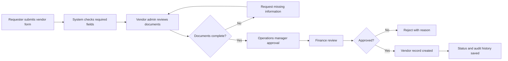

# To-Be Process

## How the Improved System Helps

The improved flow gives each request a clear stage, owner, due date, and document status. Instead of asking around, operations and finance can see where the request is stuck and what needs to happen next.
